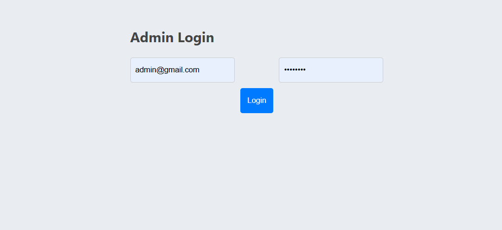
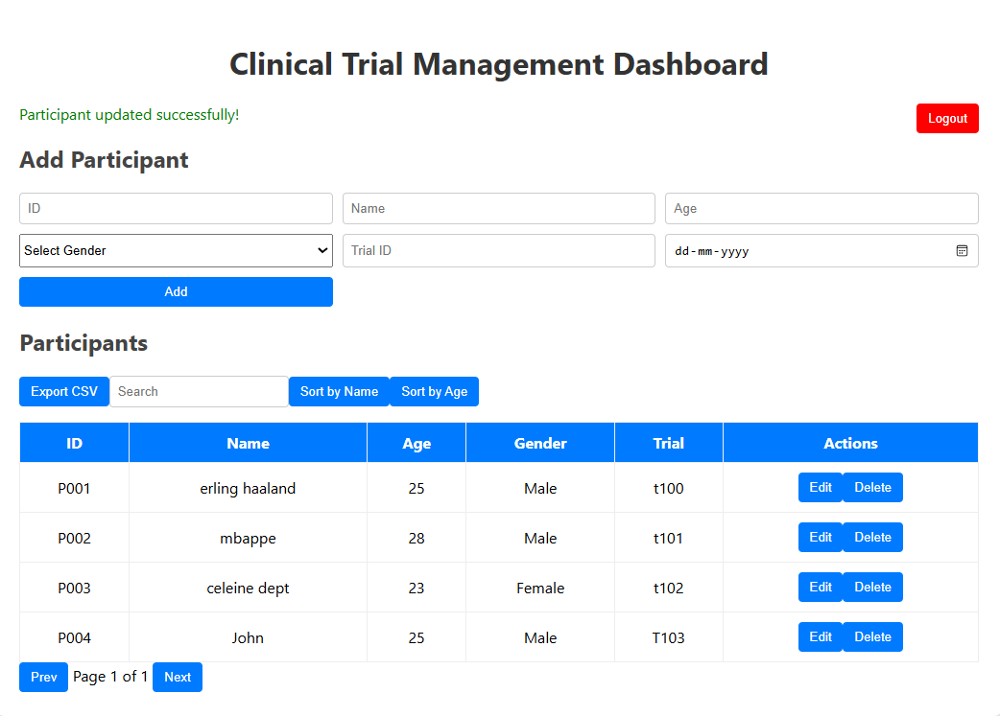

# Clinical Trial Management System

A full-stack Clinical Trial Management System for securely managing clinical trial participants.

---

## Live Demo

Frontend: https://clinical-trial-app-1.onrender.com

Backend API: https://clinical-trial-app-4x6c.onrender.com

---

## Features

- JWT Authentication
- Add Participant
- Edit Participant
- Delete Participant
- Search Participants
- Sort by Name
- Sort by Age
- Pagination
- CSV Export
- Input Validation
- Loading Indicator
- Network Error Handling

---

## Tech Stack

### Frontend
- React
- Axios
- CSS

### Backend
- Node.js
- Express.js

### Database
- MongoDB Atlas

### Authentication
- JWT

### Deployment
- Render

---

## Project Structure

```
clinical-trial-app/
│
├── backend/
│
├── frontend/
│
└── README.md
```

---

## Installation

Clone the repository

```bash
git clone https://github.com/athaulrehman0304/clinical-trial-app.git
```

Backend

```bash
cd backend
npm install
npm start
```

Frontend

```bash
cd frontend
npm install
npm start
```

---

## Screenshots

### Login



### Dashboard



---

## Author

Athaul Rehman
